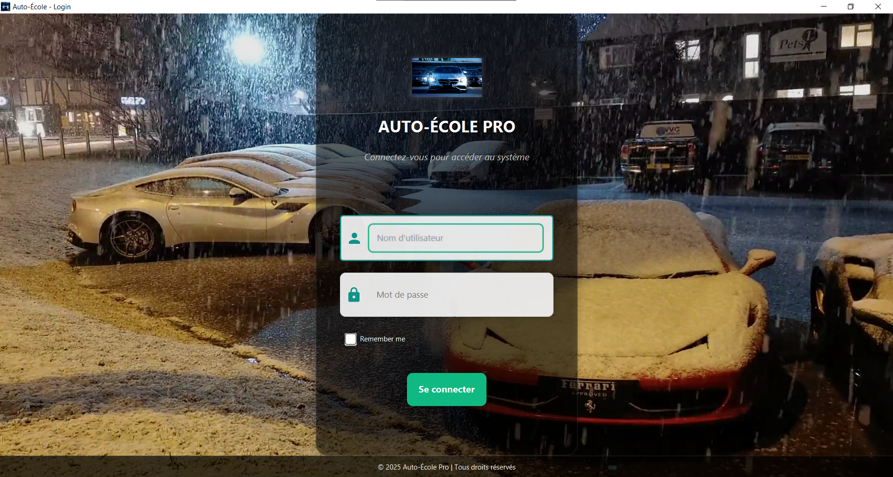
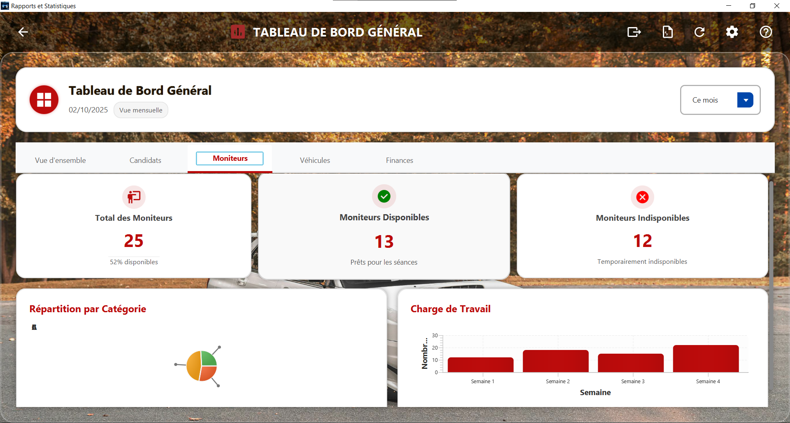
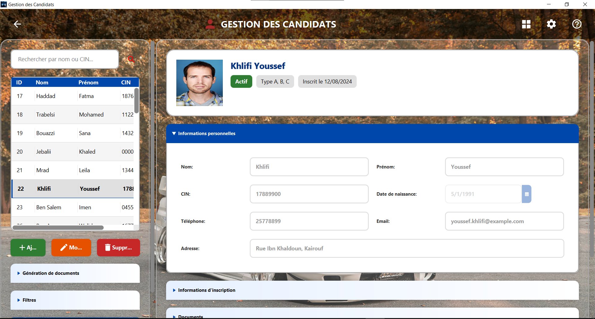
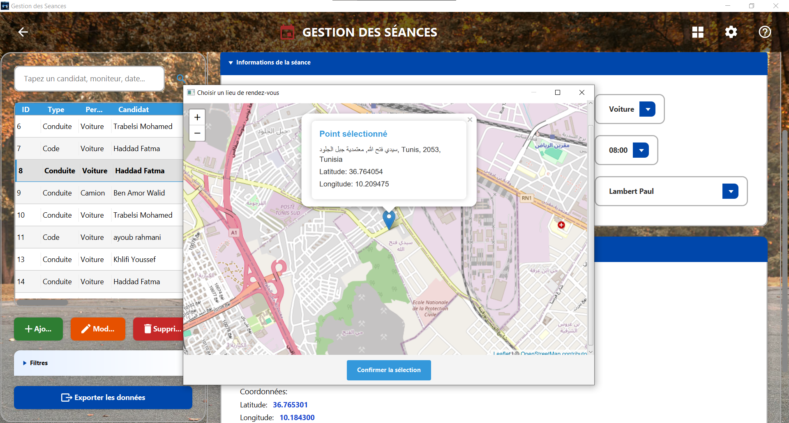
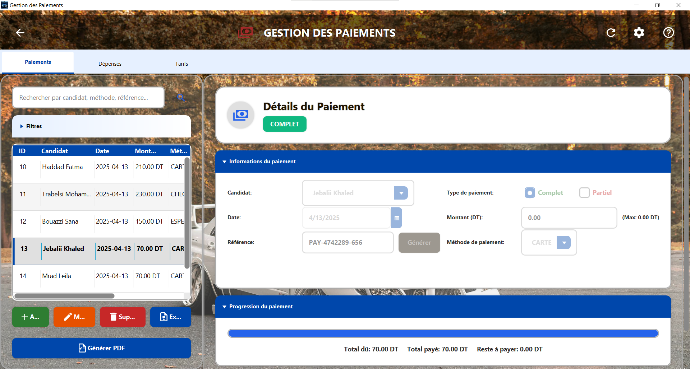
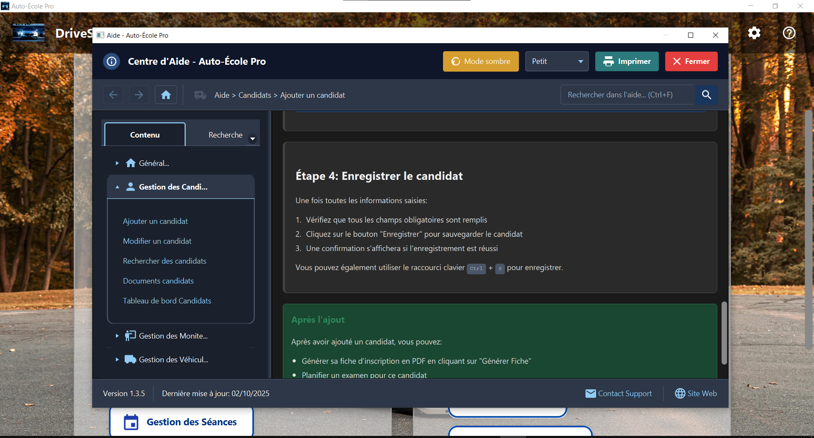

<div align="center">

# 🚗 Auto-École Pro


**A comprehensive driving school management system with intelligent scheduling, conflict resolution, and real-time analytics**

[Demo Video](#-demo) • [Features](#-features) • [Screenshots](#-screenshots)

</div>

---

## 📋 About

**Auto-École Pro** is a full-featured desktop application designed to streamline driving school operations. Built with JavaFX and MySQL, it provides an intuitive platform for managing students, instructors, vehicles, lessons, payments, and generates detailed reports with integrated map functionality and advanced conflict detection.

## ✨ Features

- 👥 **Student Management** - Complete student profiles with progress tracking and document management
- 🗓️ **Intelligent Scheduling** - Advanced calendar with automatic conflict detection for instructors, students, and vehicles
- 🗺️ **Map Integration** - Interactive OpenStreetMap for selecting lesson meeting points with GPS coordinates
- 💳 **Payment System** - Complete financial tracking with invoice generation and balance management
- 📊 **Analytics Dashboard** - Real-time statistics, instructor workload charts, and performance metrics
- 🚙 **Fleet Management** - Vehicle tracking, maintenance scheduling, and availability management
- 👨‍🏫 **Instructor Portal** - Schedule management, availability settings, and performance tracking
- ⌨️ **Keyboard Shortcuts** - Complete hotkey support for efficient workflow (Ctrl+N, Ctrl+S, F1, etc.)
- 📱 **Help Center** - Built-in searchable documentation and contextual help system
- 📄 **PDF Export** - Generate invoices, reports, and student documents
- 🔐 **Secure Authentication** - Login system with role-based access and password recovery

## 🎯 Tech Stack

- **Language**: Java 11+
- **UI Framework**: JavaFX with FXML & Scene Builder
- **Database**: MySQL 8.0
- **Architecture**: MVC Pattern with DAO Layer
- **Maps**: OpenStreetMap/Leaflet integration
- **PDF Generation**: Apache PDFBox/iText
- **Build Tool**: Maven

## 📸 Screenshots

<div align="center">

| Login Screen | Dashboard & Analytics |
|-------------|----------------------|
|  |  |

| Student Management | Session Scheduling |
|-------------------|-------------------|
|  |  |

| Payment Tracking | Help Center |
|-----------------|-------------|
|  |  |

</div>

## 🎥 Demo

[](https://www.youtube.com/watch?v=YOUR_VIDEO_ID)

*Complete walkthrough: student registration, intelligent scheduling with conflict detection, map integration, payment management, and analytics dashboard.*

## 🚀 Key Highlights

- **Smart Conflict Detection**: Automatically prevents scheduling overlaps across instructors, students, and vehicles
- **Real-time Updates**: Live synchronization of all data across the application
- **Interactive Maps**: Choose precise meeting locations with OpenStreetMap integration
- **Comprehensive Tracking**: Monitor every aspect from student registration to license acquisition
- **Professional Reports**: Generate detailed PDF reports for any date range or category
- **Keyboard Productivity**: Full keyboard shortcut support for power users
- **Built-in Help**: Contextual help system with searchable documentation

## 💡 What I Learned

- Building enterprise-level desktop applications with JavaFX
- Implementing sophisticated scheduling algorithms with conflict resolution
- Database design and optimization for complex multi-entity systems
- Integrating third-party map services into desktop applications
- Creating responsive and accessible user interfaces
- Managing concurrent operations and maintaining data consistency
- PDF generation and professional document handling

## 📝 Installation

```bash
# Clone the repository
git clone https://github.com/ayoub-rahmani/Driving_school_Pro.git

# Navigate to project directory
cd Driving_school_Pro

# Import database
mysql -u root -p < database/autoecole.sql

# Configure database connection
# Update credentials in src/config/Database.java

# Build and run
mvn clean install
mvn javafx:run
```

## 🔧 Configuration

Update database settings in `src/config/Database.java`:
```java
private static final String URL = "jdbc:mysql://localhost:3306/autoecole";
private static final String USER = "your_username";
private static final String PASSWORD = "your_password";
```

## 👨‍💻 Developer

**Ayoub Rahmani**

- Portfolio: [ayoub-rahmani.github.io](https://ayoub-rahmani.github.io)
- LinkedIn: [ayoub-rahmani-linkêdin](https://www.linkedin.com/in/ayoub-rahmani-linkêdin)
- Email: ayoub.rahmani.dev@gmail.com

---

<div align="center">

⭐ If you found this project helpful, consider giving it a star!

</div>
